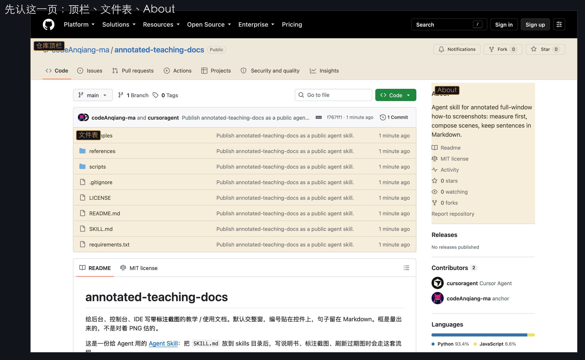
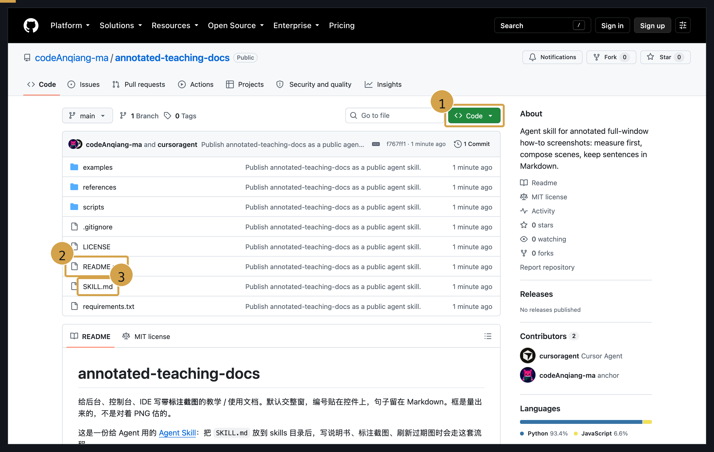
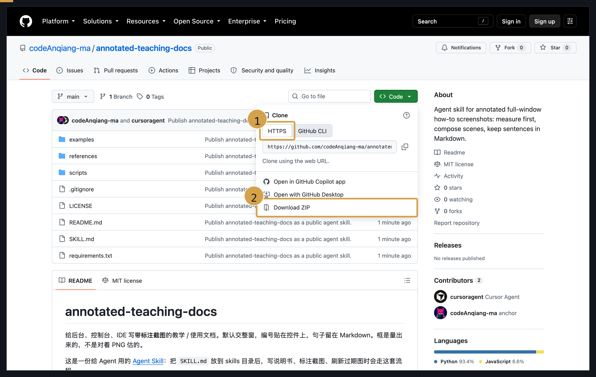
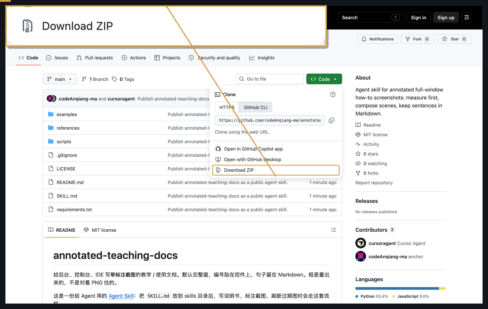
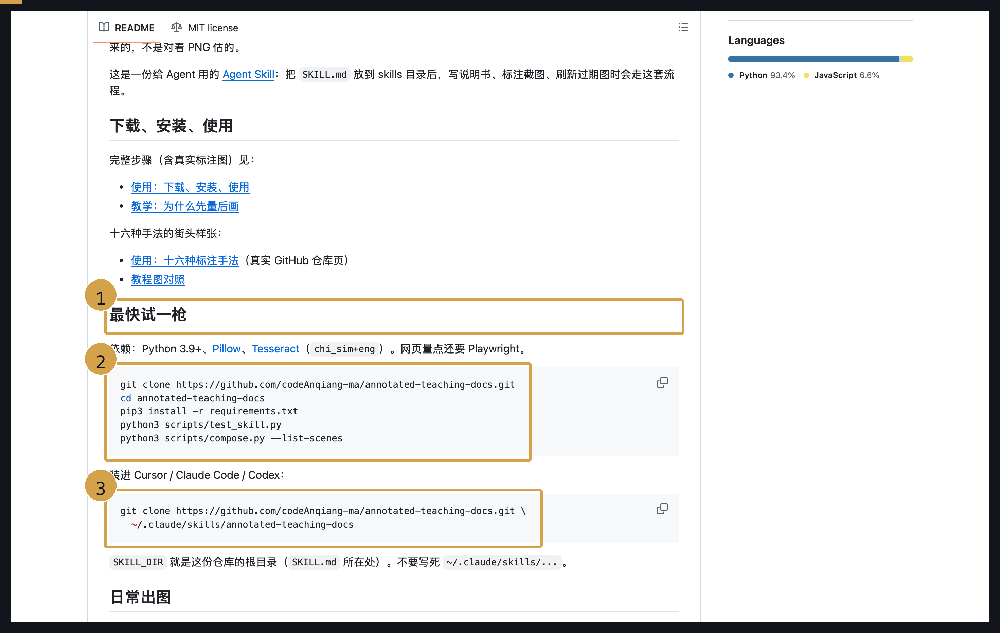
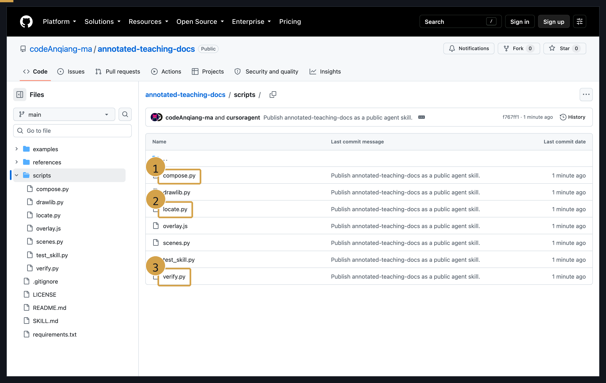

# 使用：下载、安装、使用

仓库在 [codeAnqiang-ma/annotated-teaching-docs](https://github.com/codeAnqiang-ma/annotated-teaching-docs)。  
下面的图都是这个仓库的真实 GitHub 页，框是量出来的。对照编号做即可。

原理看 [教学-为什么先量后画.md](./教学-为什么先量后画.md)。

---

## 先认这一页

打开仓库首页。顶栏是全站，中间是文件表，右侧是 **About**。先认三块，再动手。



---

## 下载

如下图 (1)(2)(3)：

1. 文件表上方点绿色 **Code**（不是顶上那个 Code 页签）
2. 看说明点 **README.md**
3. Agent 要读的流程在 **SKILL.md**



点开 **Code** 之后会出现克隆菜单。如下图 (1)(2)：

1. **HTTPS**：复制 `https://github.com/codeAnqiang-ma/annotated-teaching-docs.git`
2. 不走 git 就点 **Download ZIP**



**Download ZIP** 缩进文档后偏小，要看清这一行用放大：



---

## 安装

依赖：Python 3.9+、Pillow、Tesseract（`chi_sim+eng`）。网页量点还要 Playwright。

滚到 README 的 **最快试一枪**。如下图 (1)(2)(3)：

1. 标题 **最快试一枪**，确认没滚到别的仓库
2. 先克隆到任意目录，再 `pip3 install -r requirements.txt`，再跑 `python3 scripts/test_skill.py`
3. 要给 Cursor / Claude Code / Codex 用，克隆进 `~/.claude/skills/annotated-teaching-docs`



命令原文：

```bash
git clone https://github.com/codeAnqiang-ma/annotated-teaching-docs.git
cd annotated-teaching-docs
pip3 install -r requirements.txt
python3 scripts/test_skill.py
```

装进 Agent skills 目录：

```bash
git clone https://github.com/codeAnqiang-ma/annotated-teaching-docs.git \
  ~/.claude/skills/annotated-teaching-docs
```

macOS 还要：

```bash
brew install tesseract tesseract-lang
pip3 install playwright
python3 -m playwright install chromium
```

`SKILL_DIR` 就是这份仓库的根目录（**SKILL.md** 所在处）。不要写死 `~/.claude/skills/...`。

---

## 使用（出一张图）

进 `scripts/`。日常只用这三个文件。如下图 (1)(2)(3)：

1. **compose.py**：按 `marks.json` 出图，加 `--scene`
2. **locate.py**：对着现成 PNG 找屏幕上的字，得到 `space=image`
3. **verify.py**：合成后立刻跑，框飞了或肥了会失败



网页（后台 / 控制台）：

1. 注入 `scripts/overlay.js`
2. `teachingMeasure` 每个选择器都 `ok: true`
3. 截 **浏览器视口**，不要 `screencapture -l`
4. `compose.py --scene multi` 再 `verify.py`

```bash
python3 "$SKILL_DIR/scripts/compose.py" \
  --image window.png --meta marks.json --out docs/images/01-repo-home.png --scene multi
python3 "$SKILL_DIR/scripts/verify.py" \
  --image window.png --meta marks.json --composed docs/images/01-repo-home.png
```

桌面 App / 已经有的 PNG：

```bash
python3 "$SKILL_DIR/scripts/locate.py" \
  --image window.png --find "README.md" --find "SKILL.md" \
  --out marks.json --probe-dir /tmp/probes
```

写文档时：教学用 `教学-*.md`，使用用 `使用-*.md`。默认介绍在 Markdown，图上只有编号。

十六种手法的完整对照：[使用-十六种标注手法.md](../examples/street-github/使用-十六种标注手法.md)。
