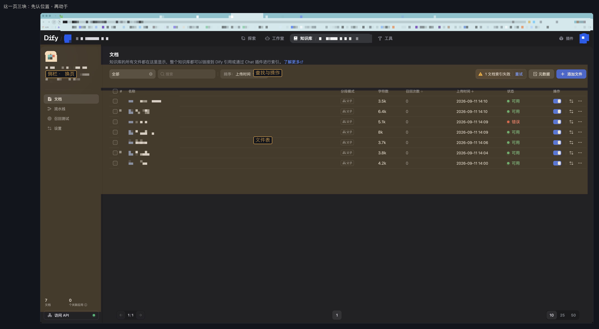
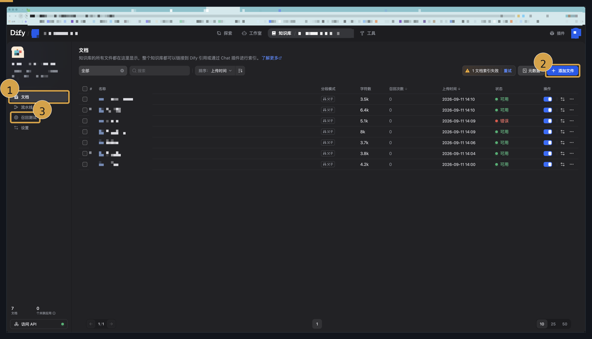
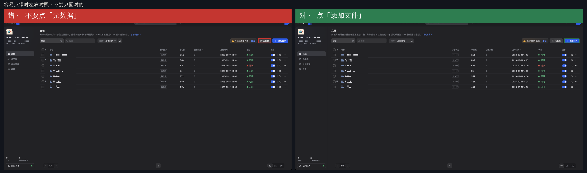

# 教学：Dify 文档列表

使用步骤看 [使用-Dify文档列表.md](./使用-Dify文档列表.md)。  
这里只讲怎么判断自己在正确的页、点对了控件。图上的库名和文件名已打码。

---

## 怎么确认进对了库

看三处是否对得上你要维护的那一个库（图里已打码，你对着自己屏幕核）：

- 顶栏 **知识库 /** 后面的名字
- 左侧机器人下面的库名
- 地址栏是 `/datasets/…/documents`，不是别的产品后台

对不上就先回到知识库列表，再点进来。不要在错的库里点 **添加文件**。

---

## 三个入口各管什么

| 入口 | 用来干什么 | 看哪里能确认 |
|---|---|---|
| **文档** | 文件在不在、状态是否可用 | 左侧该项是选中条；中间是文件表 |
| **添加文件** | 把材料导进当前库 | 右上蓝色按钮，不在侧栏 |
| **召回测试** | 用对客问法试检索 | 左侧该项变成选中；主区出现查询框 |
| **设置** | 分段、检索怎么配 | 侧栏最下面；本页不改设置 |
| **元数据** | 字段，不是导入 | 在 **添加文件** 左边，灰色 |

同一屏连续动作见使用文档图 (1)(2)(3)。

---

## 为什么容易点错

**元数据** 和 **添加文件** 排在同一条工具栏。要导入时只点蓝色那个。左边灰色那个不会把文件加进来。

