# 教程图：十五种手法对照

同一张 **Dify 文档列表** 整窗。框仍按原图像素量。  
网上查了 GitHub Docs、Scribe/Tango、Snagit、ScreenGuide、Mozilla SUMO、PixPin / Snipaste、Apple 式引线标注。

先看总览，再点下面各张。

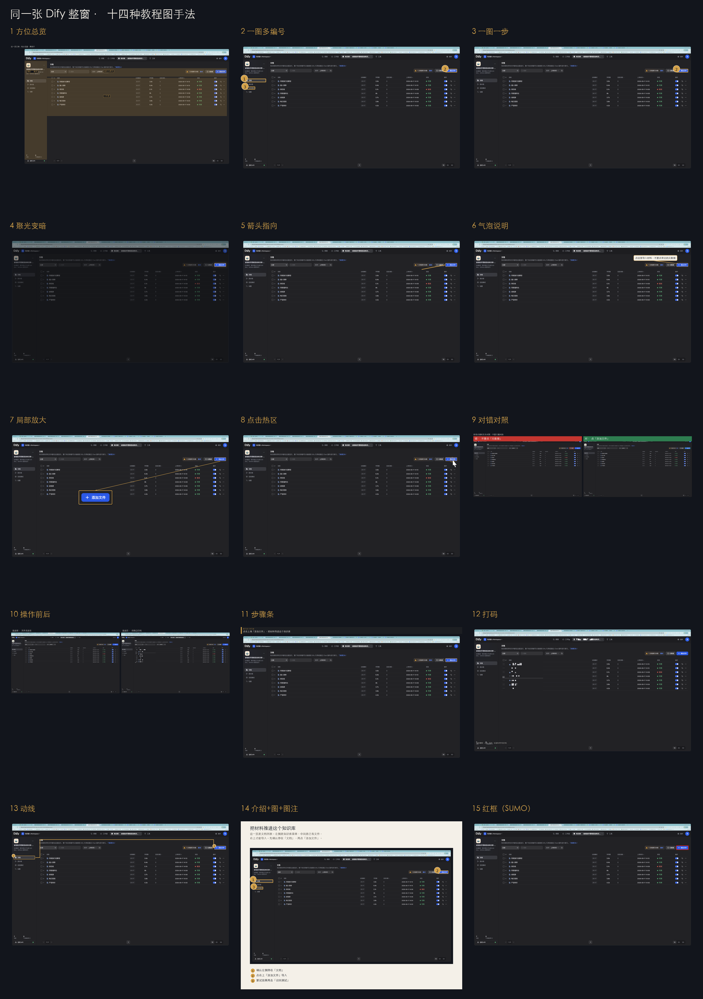

别人的放大镜示意（PixPin）：局部放大，连线对回原位置。

英文原页样图也存下来了（`refs/en/`）。网上其实是两派：

- **官方文档**（GitHub / Cloudflare / DigitalOcean / Stripe）：图尽量干净，句子在正文。GitHub 禁止变暗、禁止光标、禁止图上独占长句。
- **SOP / 录屏工具**（ScreenSteps / Tango / Scribe / Snagit）：箭头、编号、引线、变暗都用。ScreenSteps 单图序号不超过 4，且必须对正文列表。

GitHub：只框难找的那个，周围留够认路。

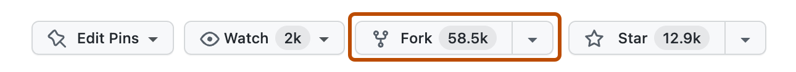

Azure：整窗认路，红框编号，说明在图下表。这就是「方位图」。

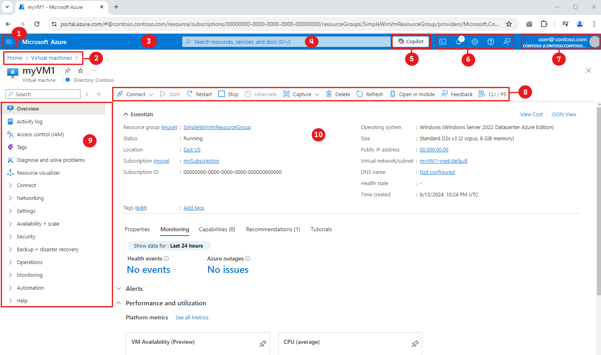

ScreenSteps：一图两步，序号箭头对正文。

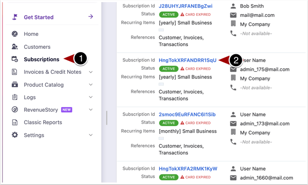

Tango：橙框在图上，步骤句贴在图下，不压界面。

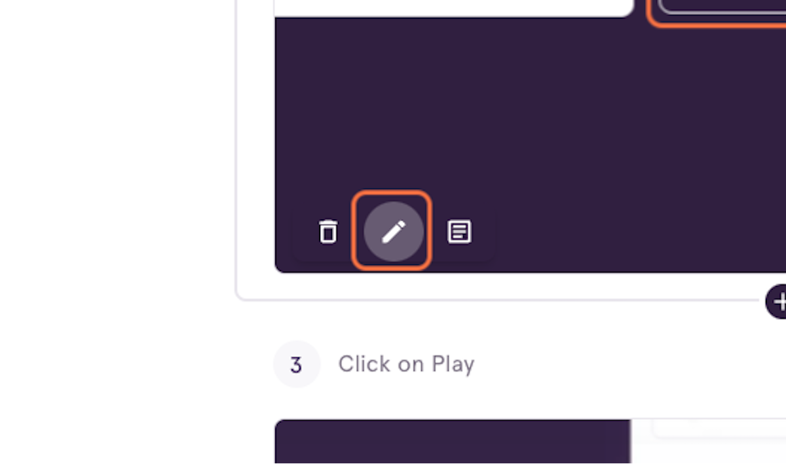

Tango 认图标：引线短标签 + 变暗 + 指针。GitHub 不让这么干。

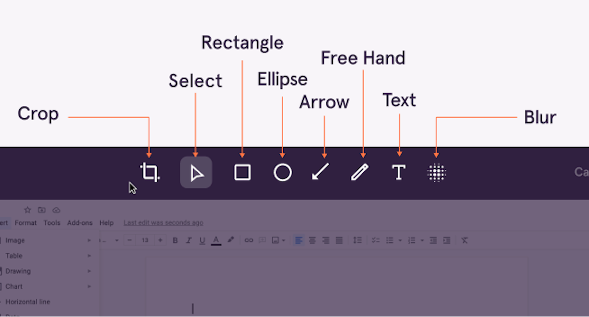

ScreenSteps 会把整句写进图。官方文档派反对。

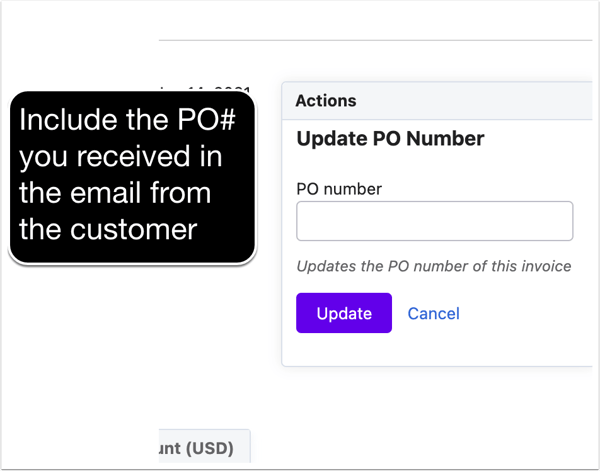

逐步操作的原页也在 `refs/scenes/`。和上面十五种对得上的几张：

Apple 认工具栏：引出线短标签，不是圆点编号。

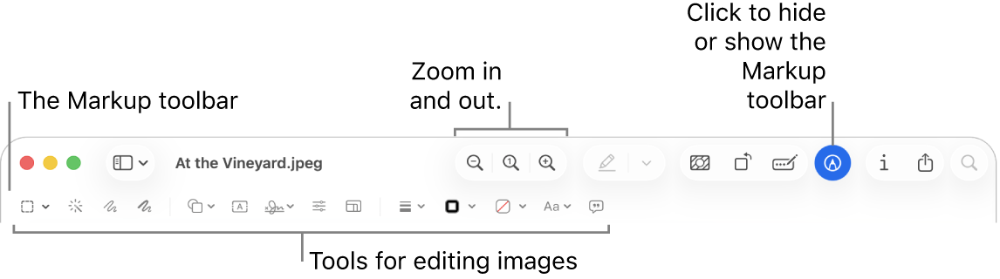

ScreenSteps 同一对话框标 1 2 3，对应我们的「一图多编号」。

侧栏点一下、主区再点一下，对应「动线」。

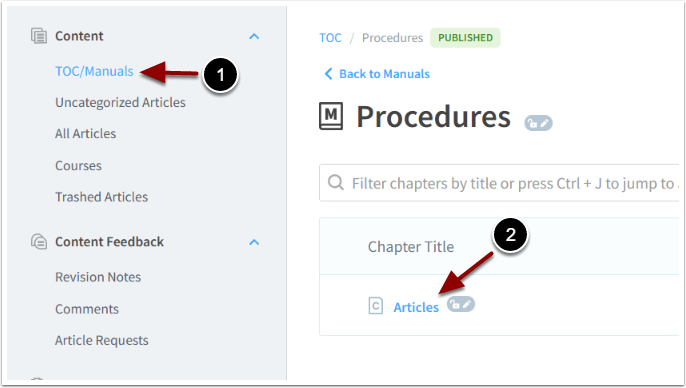

Snagit 长流程：每步标题叠在图顶，图里再加点击热区。

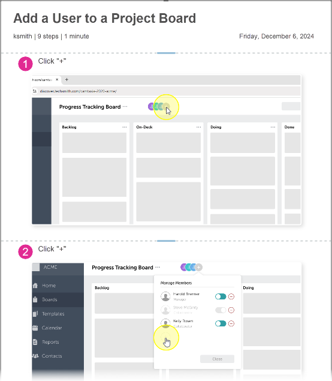

中文帮助中心（`refs/zh/`）和英文官方文档不一样：默认红色、①②③ 画在图上、图上可以写中文、正文用「如图 / 红框内」对上。云文档更爱裁弹窗。石墨、钉钉常不画框。Dify 中文文档反而更像英文 SaaS，偶尔一个红框。

阿里云：整窗橙序号，认控制台路径。

企业微信：整窗蓝框 + 编号，和我们「一图多编号」最像。

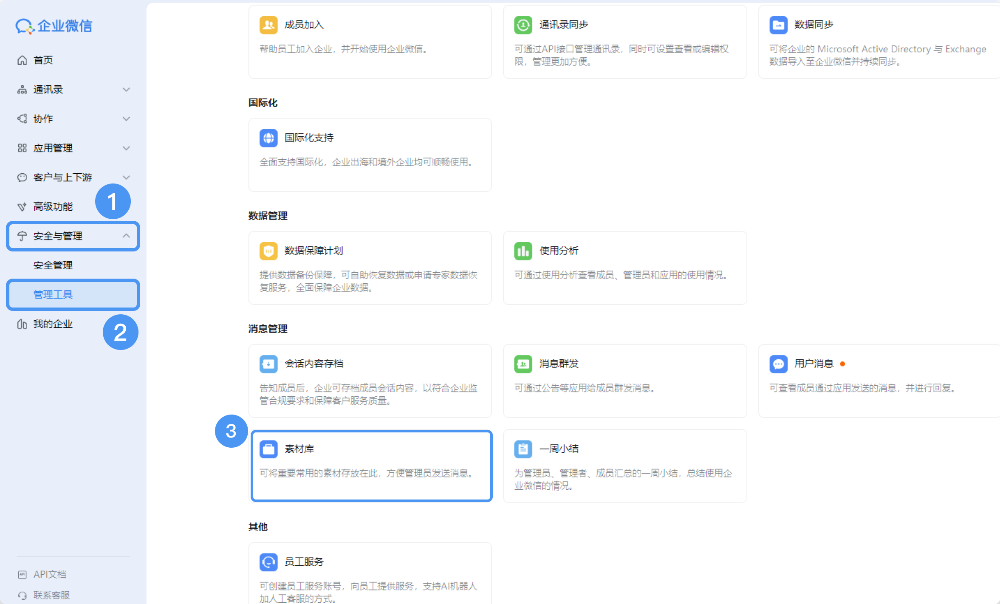

华为云：裁切对话框，红框 + 序号，正文写「单击红框内」。

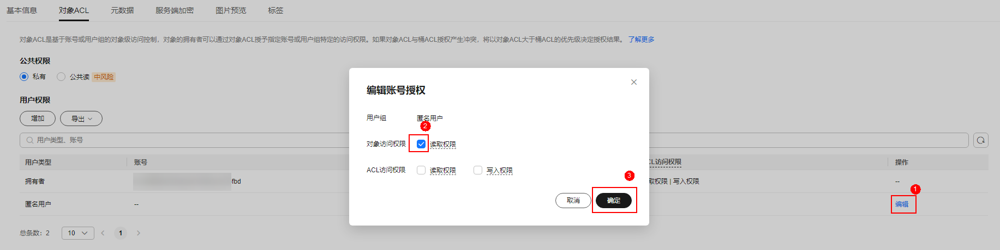

PixPin / 公众号：图上直接写「点击设置自定义颜色」。

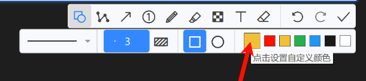

---

## 1 方位总览

先认「这一页有几块」，不圈具体按钮。Apple 文档常用区外标签；中文帮助中心也爱先画模块。

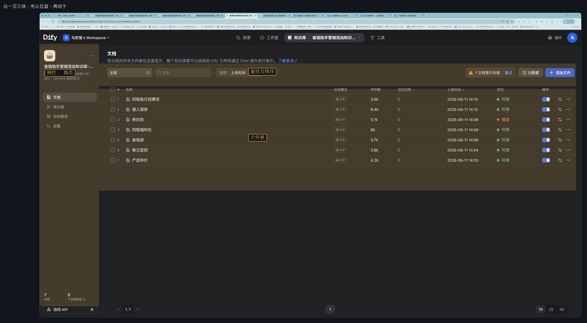

**用来：** 教学文开头、使用文第一节。  
**说明写在：** 图上短标签 + 正文解释每一块干什么。

---

## 2 一图多编号

Tango / ScreenGuide / Docsie：一图 1 2 3，正文同一套编号。GitHub 很少一图多步。

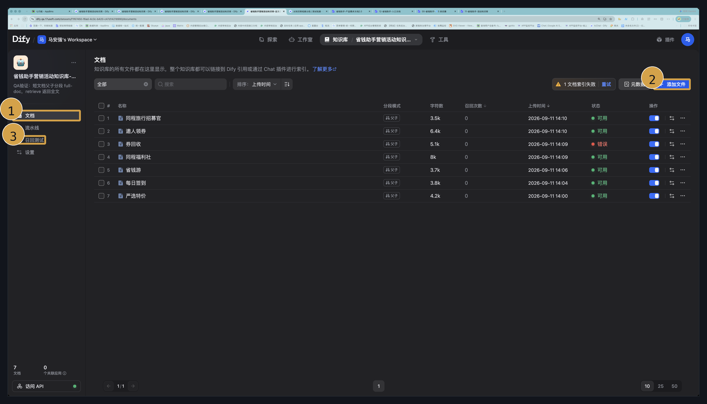

**用来：** 同一屏上连续两三个动作。  
**说明写在：** 图下列表，图上只有数字。

别人同一对话框里也这样标：

---

## 3 一图一步

Scribe / Tango 默认：一步一张，只标当前点击。

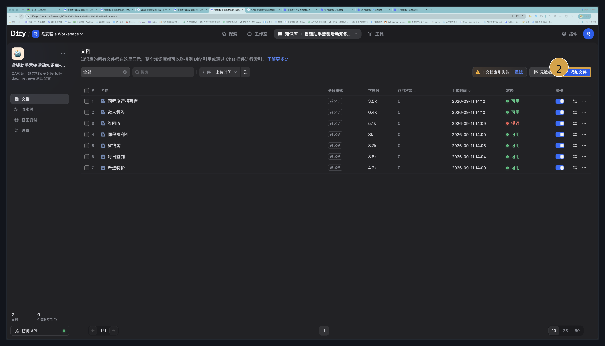

**用来：** 怕读者走错顺序，或下一步会换页。  
**说明写在：** 这张图上面那一句步骤。

---

## 4 聚光变暗

Scribe / 部分 onboarding 会压暗四周。GitHub Docs **明确禁止**：界面必须保持原对比度。

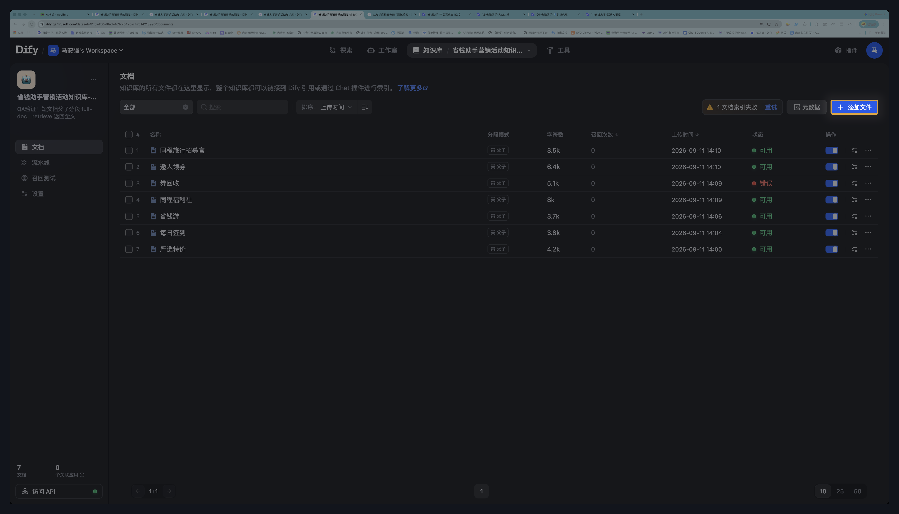

**用来：** 按钮很小、周围很乱。  
**代价：** 读者更难看清自己在哪。深色后台要克制。

---

## 5 箭头指向

Snagit / ScreenGuide：箭头从空白处指向目标，不要从另一个按钮出发。

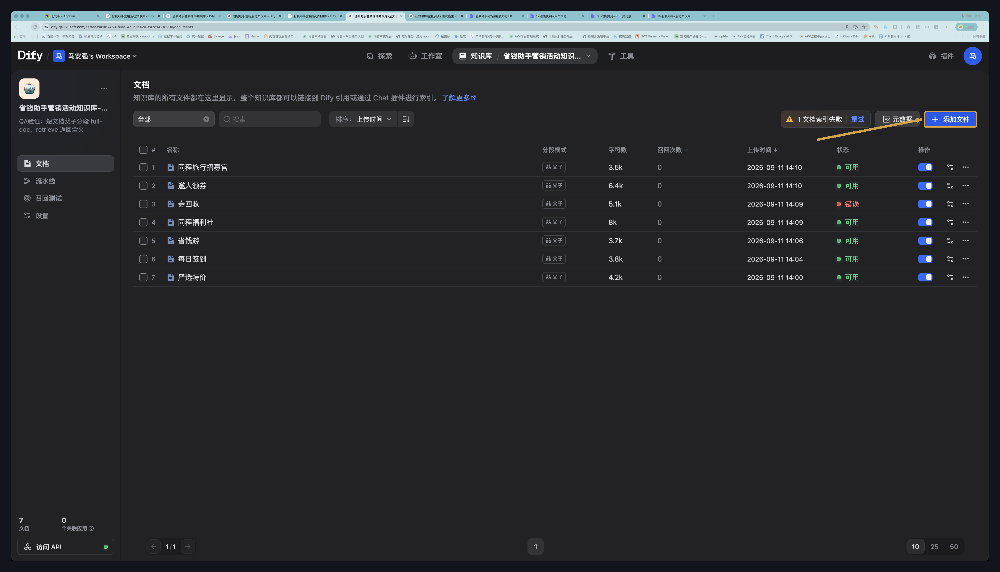

**用来：** 「在哪」比「第几步」更重要。  
**说明写在：** 正文。箭头本身不写字。

---

## 6 气泡说明

Snagit Callout、国内红框教程：图上写短句。Apple 翻译项目更建议图上只留编号。

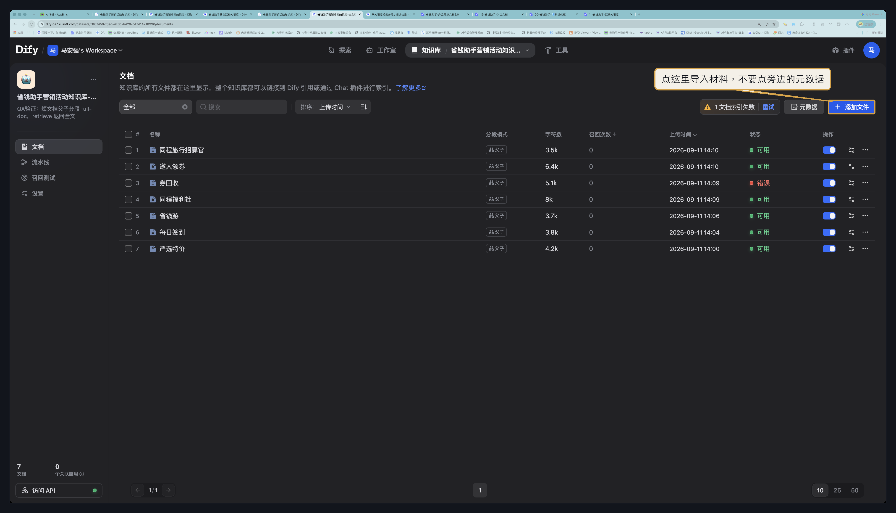

**用来：** 一句就能说完的提醒（别点旁边那个）。  
**字数：** 不超过十来个字。长句放正文。  
**不准挡：** 气泡和短标签都不能压住其它按钮。控件挤在一起时改用 **引线**：字放空白，线指过去（对照页开头的 Apple / Tango 样张；ScreenGuide：callout adjacent, not on top）。

---

## 7 局部放大

PixPin / Snipaste 专业版：整窗保留位置，放大块看清按钮。

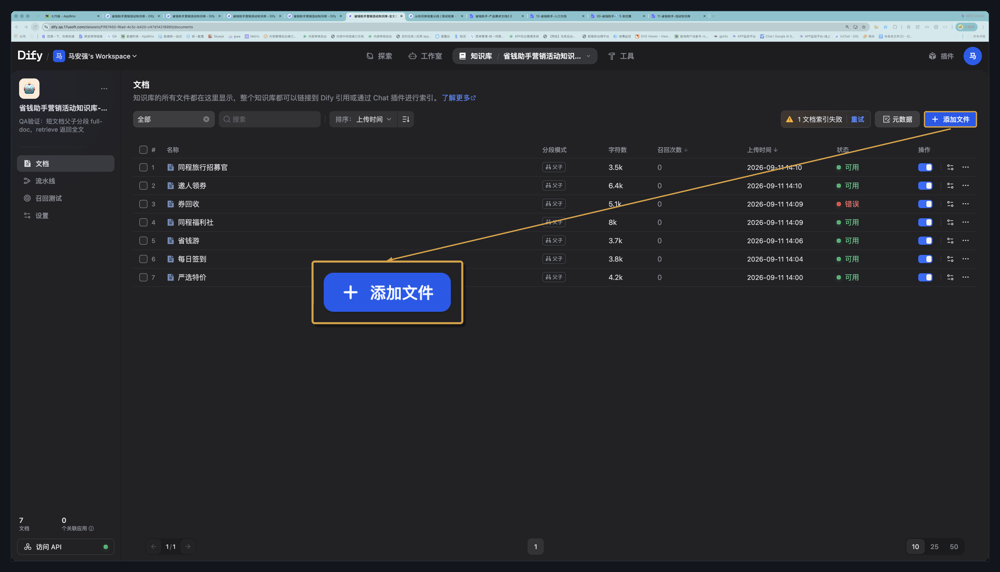

**用来：** 控件小、缩进文档后看不清。  
**一张图：** 一个主放大就够。

---

## 8 点击热区

Scribe 自动加点击标记。GitHub **不要鼠标指针**。

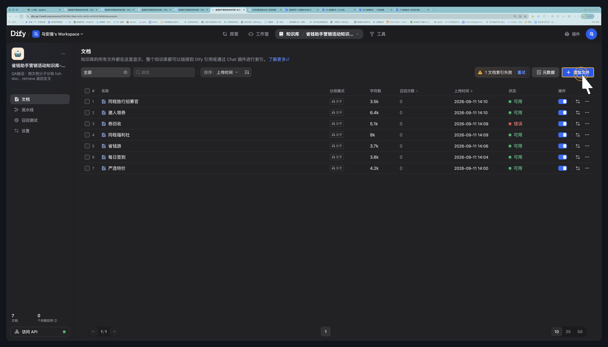

**用来：** 强调「点下去」，不是「看这里」。

---

## 9 对错对照

容易点错时，左右并排。只圈对的，读者仍可能点旁边的「元数据」。

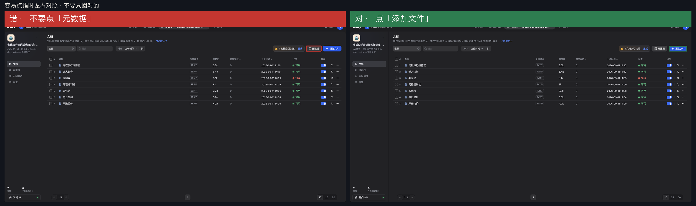

**用来：** 两个长得像的按钮。  
**说明写在：** 每侧顶上那条色带。

---

## 10 操作前后

Before / After。这里用「发出前还能看见文件名 / 发出后已打码」。

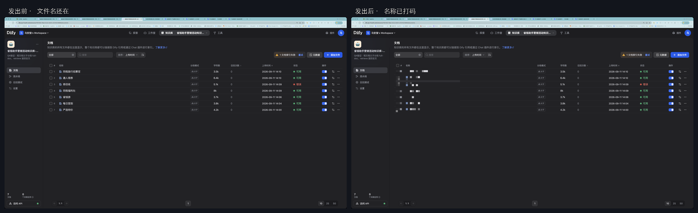

**用来：** 状态变了、导入成功了、打码前后。

---

## 11 步骤条

帮助中心常见：图顶写「第 2 步 / 共 3 步」+ 这一步要干什么。

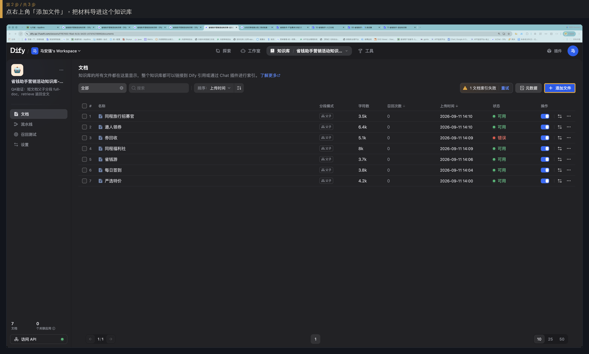

**用来：** 长教程里读者会迷路。  
**说明写在：** 图顶那条，图上仍只框控件。

Snagit 原页：步骤句叠在每张图顶，里面再画点击。

---

## 12 打码

Scribe / Tango / GitHub 都要求对外图去掉人名、库名、未发布文件。

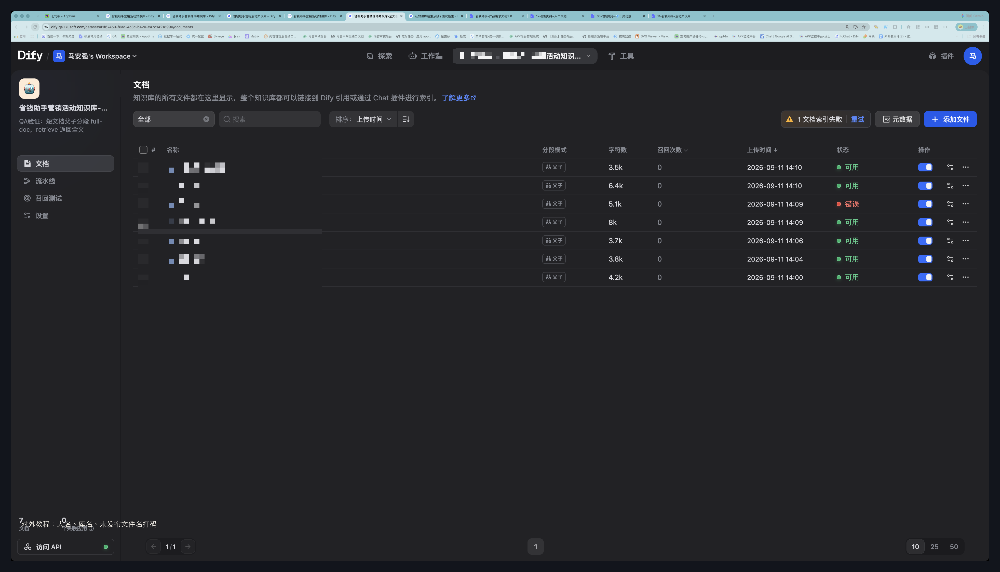

**用来：** 任何要发出去的教程。和「前后」可合成一张。

---

## 13 动线

从侧栏到右上：先停在文档，再去添加文件。

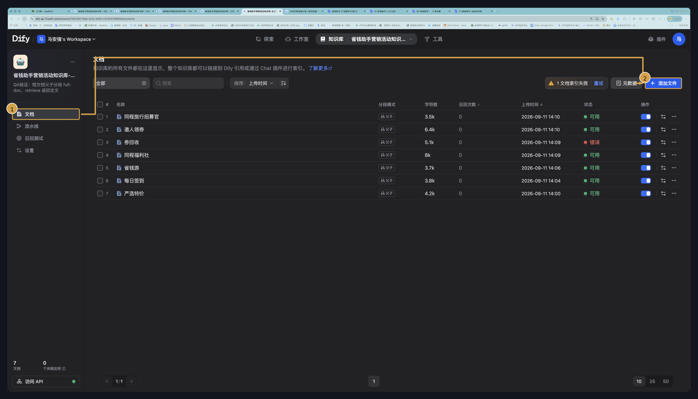

**用来：** 视线要跳很远的两下。编号仍要对正文。

别人从侧栏拉到主区：

---

## 14 介绍 + 图 + 图注

这才是一篇教程页的样子：先讲这一页是什么，再放整窗图，下列表跟编号对齐。Haiku / GitHub：句子在图外，图上不承担全部说明。

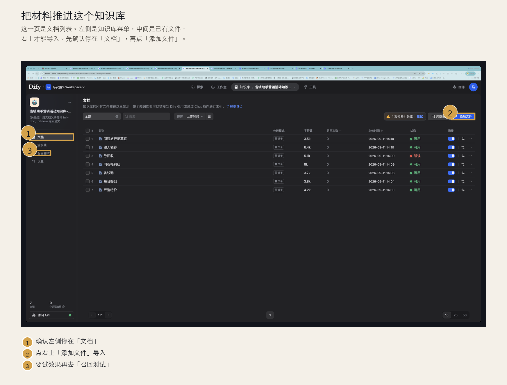

**用来：** 默认排版。上面那些手法是图里的变化，这篇是图外怎么写。

---

## 15 红框（Mozilla SUMO）

中文社区和 Firefox 文档：直角红框 `#f71701`，不加编号。GitHub 用深橙 `#BC4C00`，规矩类似。

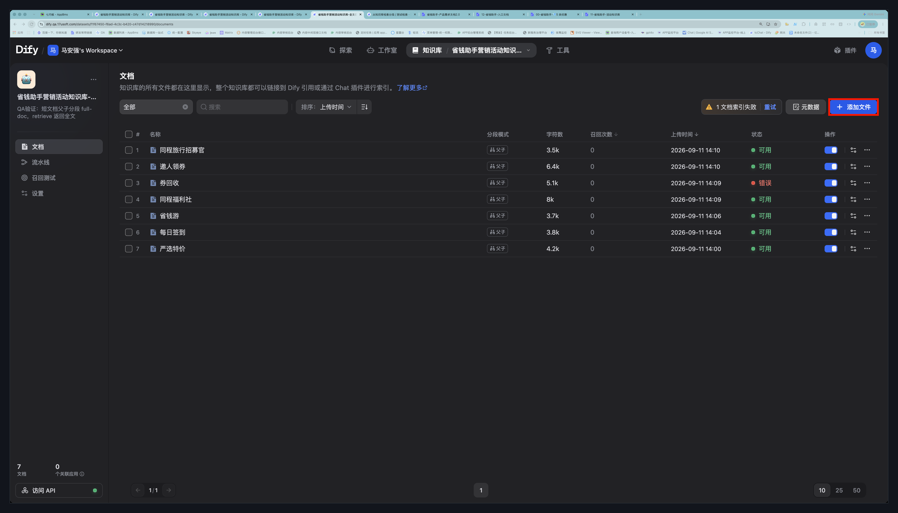

**用来：** 只标一个目标、不要步骤感。  
**别：** 一图好几个无编号红框。

华为云原页是红框 + 序号，正文写「单击红框内」：

---

## 做教程时怎么选

| 你要干的事 | 用 |
|---|---|
| 读者还不认识这页 | 1 总览，再 14 那种正文 |
| 同一屏连续点几下 | 2 多编号 |
| 一步换一页 / 怕乱序 | 3 一图一步，可加 11 步骤条 |
| 按钮小、缩了看不清 | 7 放大 |
| 旁边有个很像的 | 6 气泡 或 9 对错 |
| 视线要飞到对角 | 5 箭头 或 13 动线 |
| 强调「点下去」 | 8 点击（正式文档可不用） |
| 对外发出 | 12 打码，必要时 10 前后 |
| 默认 | **整窗 + 编号框 + 句子在 Markdown**（2 + 14） |

GitHub 三条现在仍然成立：图上不写长句、不要把界面变看不清、说明必须能离开图读懂。
