# 使用：十六种截图标注

这一页是真实的 **GitHub** 仓库首页：`microsoft / vscode`。  
图是 Playwright 视口实拍（1440×900），框是 `teachingMeasure` 量出来的，不是目测。  
句子写在这篇文档里。图上默认只有编号；只有「别点旁边那个」才用短气泡。

干净原图在 [00-window.png](./00-window.png)。

---

## 先认这一页

顶栏是全站。下面一排才是这个仓库的页签。中间是文件表，右侧是 **About**。先认三块，再动手。

- **仓库页签**：Code、Issues、Pull requests 都在这一条
- **文件表**：当前分支里的目录和文件
- **About 侧栏**：简介、星标数、Release，不是操作入口

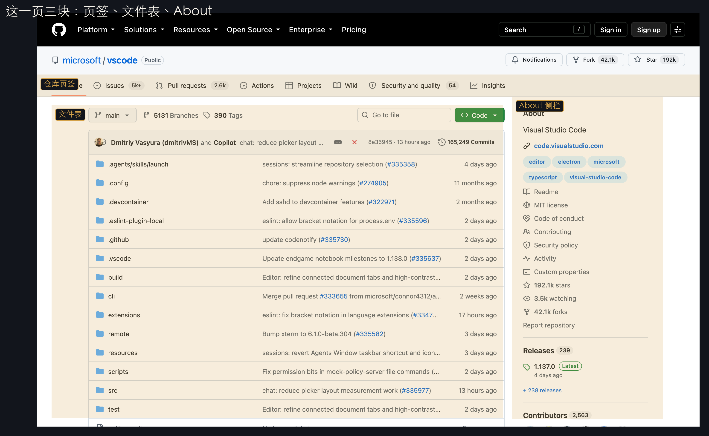

---

## 在这一页做三件事

如下图 (1)(2)(3)：

1. 确认停在 **Code**（看代码、看文件）
2. 要提 bug 再去 **Issues**
3. 要看别人的改动去 **Pull requests**

这三下都在同一条页签上，一张图就够。超过四个点再拆第二张整窗。

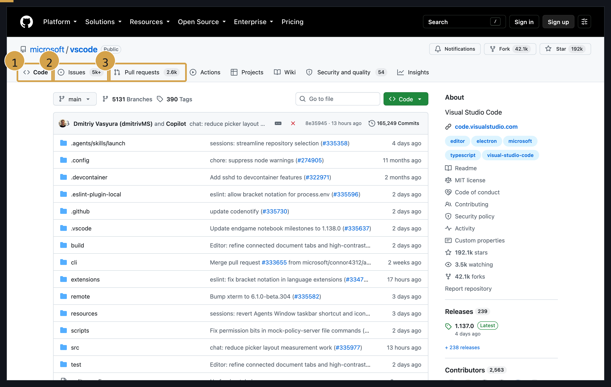

---

## 怕乱序时只标当前一下

下一步会换页，或读者容易跳着点，就不要一图三个号。这一张只圈 **Code**。

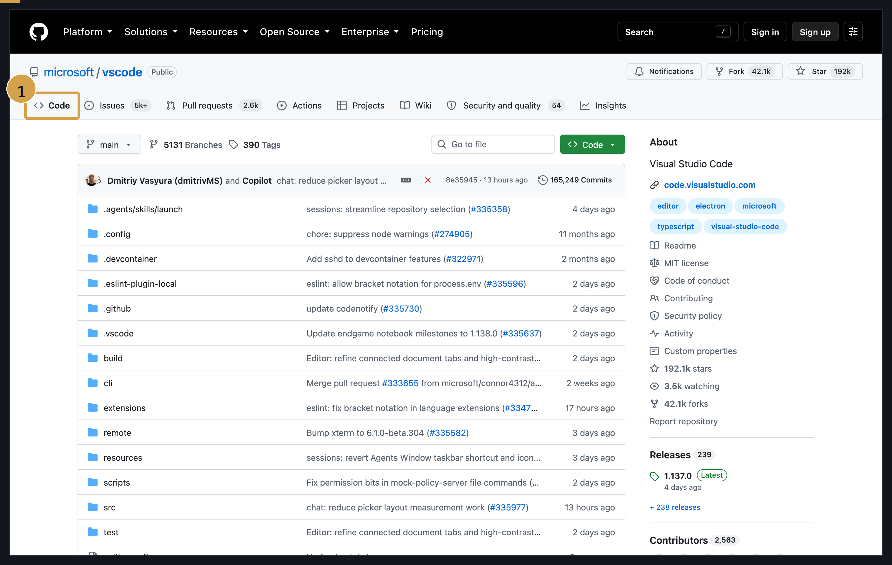

---

## 别点错旁边的按钮

要收藏仓库时，点右上 **Star**。它左边是 **Fork**。  
**Fork** 会复制一份到自己账号，不是收藏。

左右对照，不要只圈对的：

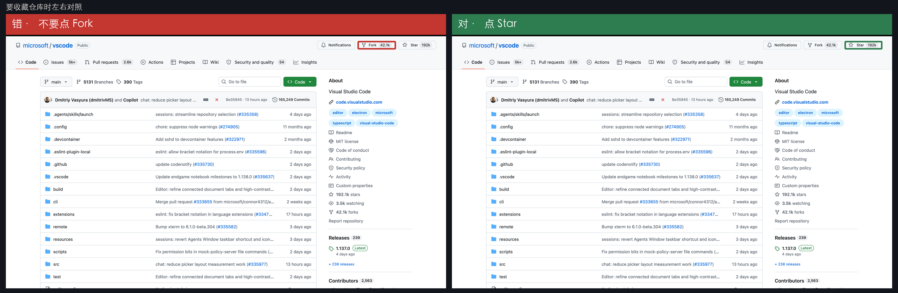

一句话就能说完时，用气泡。字放空白，线指 **Star**：

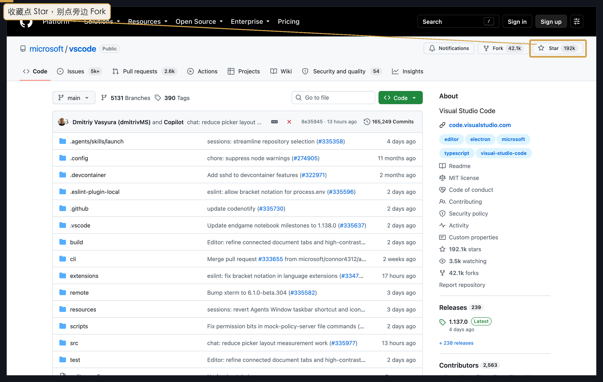

---

## 按钮缩了看不清

**Star** 只有二十几像素高，缩进文档后框会看不清。整窗留下认路，再把 **Star** 放大连回原位。

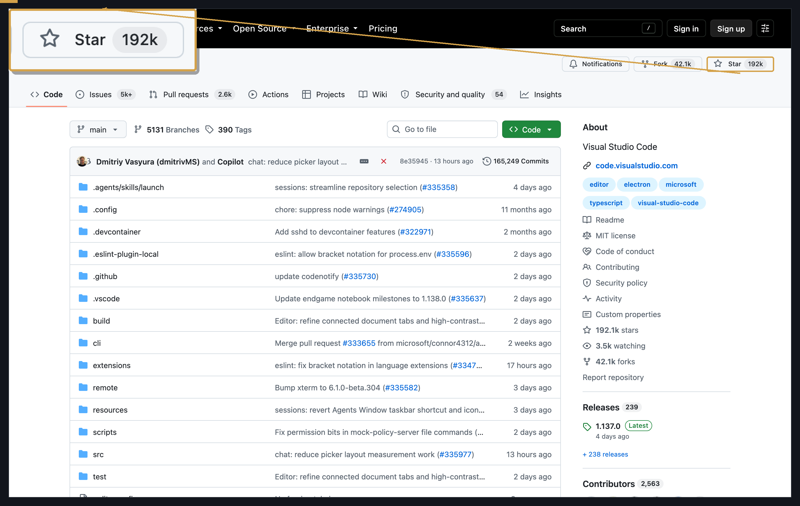

只标这一个目标、不要步骤感时，用红框。正文写「单击图中红框内」：

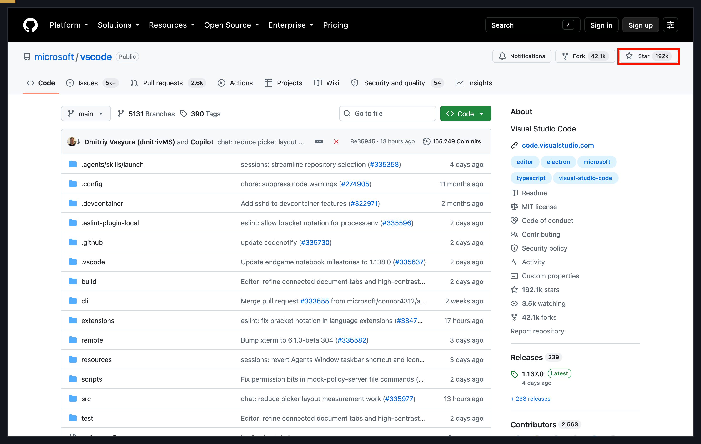

---

## 视线要飞到对角

先停在左侧 **Code**，再去右上 **Star**。两点隔得很远，用动线把顺序画出来。编号仍要对正文：

1. **Code**
2. **Star**

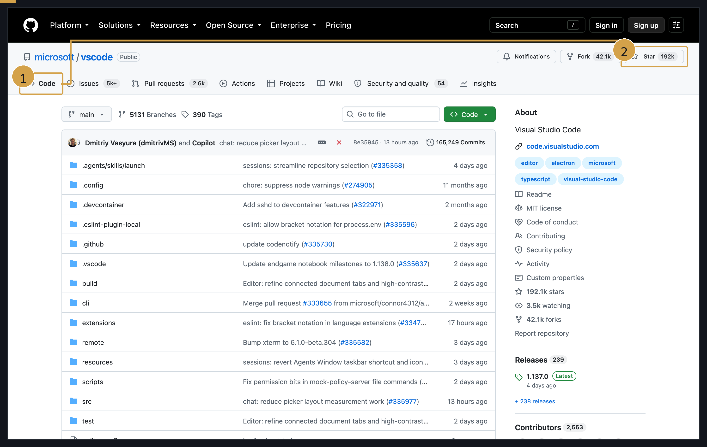

从空白指向目标、图上不写字，用箭头：

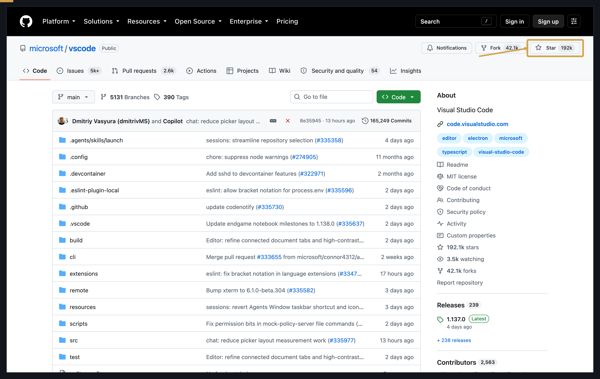

控件挤、又要写出名字，用引线。字放空白，细线指过去，不准压在按钮堆上：

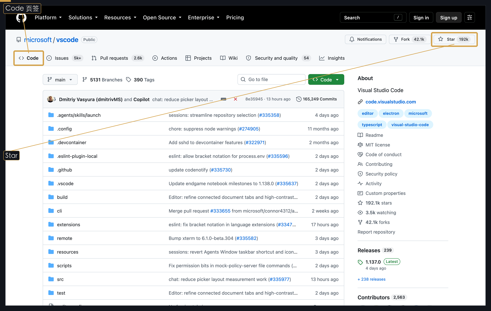

---

## 强调「点下去」

要读者点 **Star**，不是「看这里」。正式 GitHub 文档不要鼠标指针；SOP / 录屏可以用。

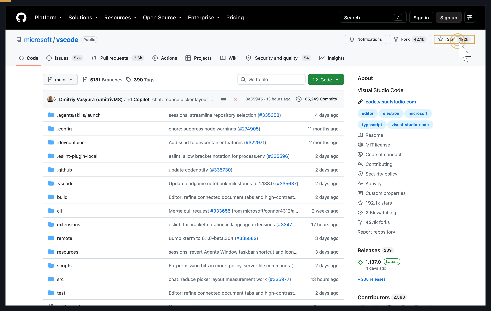

长流程怕迷路，图顶加步骤条。这一张是第 2 步 / 共 3 步：点右上 **Star**，把仓库收进自己的列表。

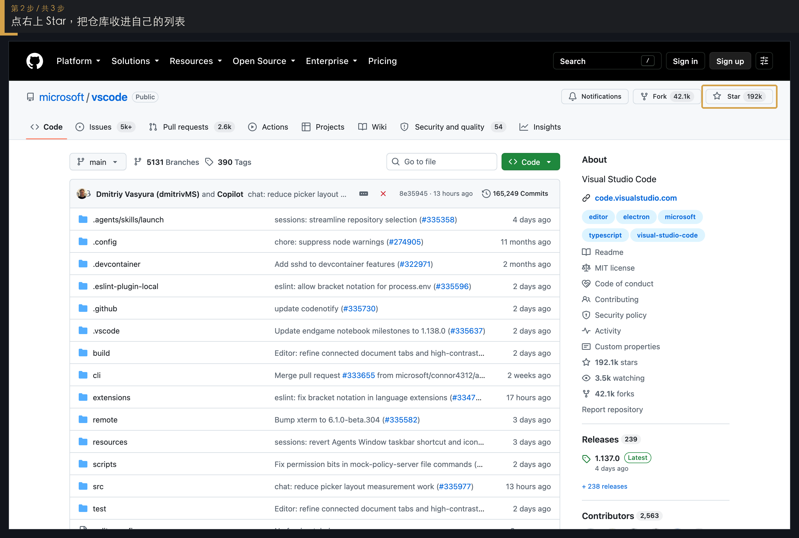

四周压暗、只留 **Star**，Scribe 在用。GitHub Docs **禁止**：深色顶栏会把整页吃黑。默认不要用。

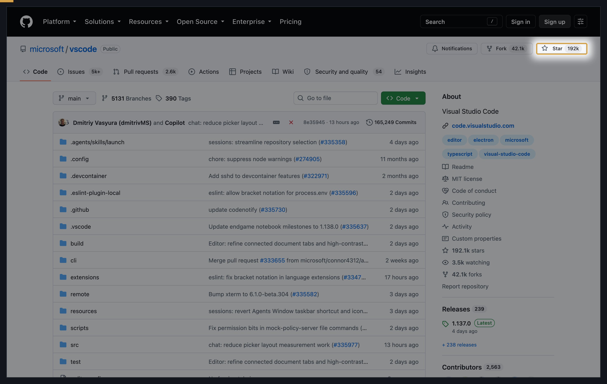

---

## 对外发出前打码

人名、组织名、未发布库名不能直接外发。如下图：`microsoft`、`vscode`、贡献者名已打码。正文不要依赖被糊掉的字。

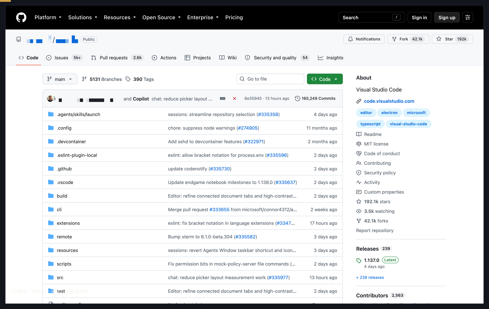

同一窗左右对照：发出前还能看见人名，发出后已打码。

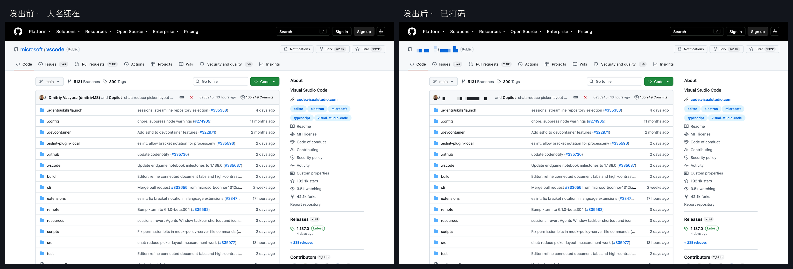

---

## 一篇教程页实际长这样

先讲这一页是什么，再放整窗图，下列表跟编号对齐。信息不能只出现在图上。

如下图 (1)(2)(3)：

1. 停在 **Code**
2. **Issues** 是工单，不是代码
3. 收藏点 **Star**

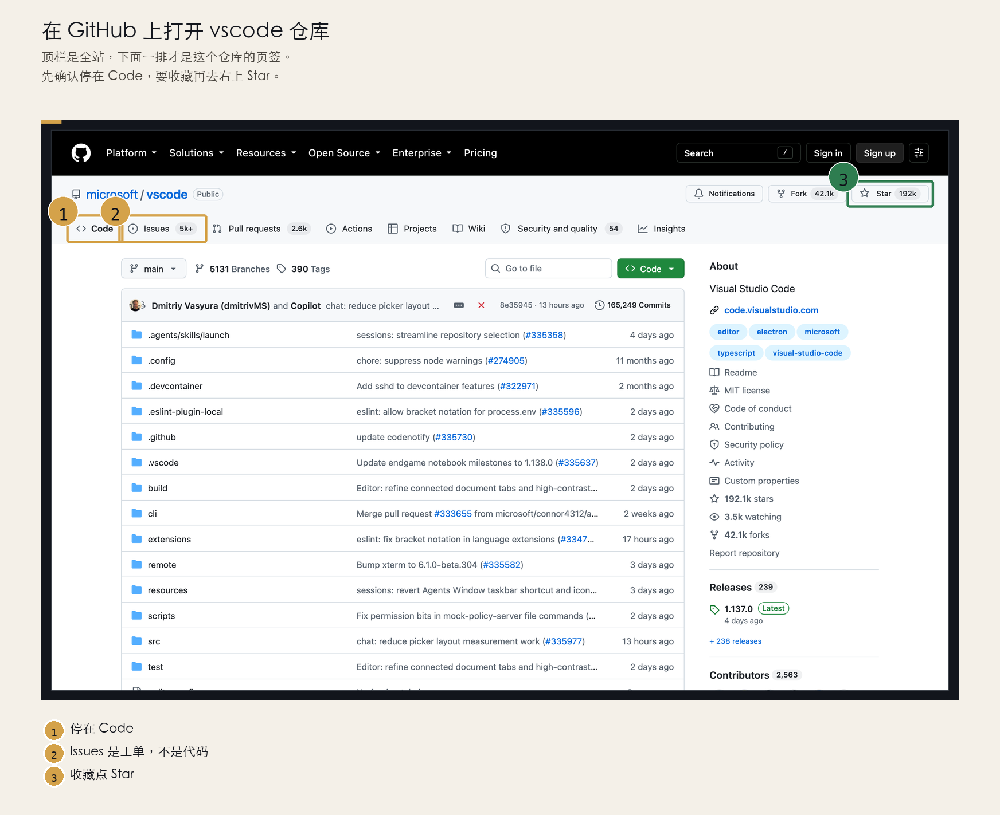

---

## 选题（这一步要干什么）

| 这一步要干什么 | 手法 | 看上面哪一节 |
|---|---|---|
| 还不认识这一页 | 方位总览 | 先认这一页 |
| 同一屏连续点几下 | 一图多编号 | 做三件事 |
| 怕乱序 / 下一步换页 | 一图一步 | 只标当前一下 |
| 旁边有个很像的 | 对错 / 气泡 | 别点错 |
| 按钮缩了看不清 | 放大 / 红框 | 按钮缩了 |
| 视线飞到对角 | 动线 / 箭头 / 引线 | 飞到对角 |
| 强调点下去 | 点击 / 步骤条 | 点下去 |
| 对外发出 | 打码 / 前后 | 打码 |
| 默认成稿 | 介绍 + 图 + 图注 | 教程页 |

坐标一律先量。网页截浏览器视口（`space=css`），不要对网页用 `screencapture -l`。
